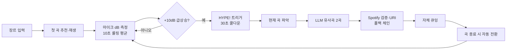

# 🌊 HYPEWAVE

> 관중의 함성을 듣고 다음 곡을 스스로 고르는 **군중 반응형 오토 DJ**

**🔴 라이브 데모 → https://crowddjdj.vercel.app**
**📖 사용 가이드(HTML) → https://claude.ai/code/artifact/8ab1e46c-2757-4efe-9114-7319bc06ac44**

파티 관중의 환호(마이크 **데시벨 스파이크**)를 감지해, 그 순간 재생 중이던 곡과
어울리는 다음 곡을 **LLM으로 추천 → Spotify에서 검증 → 끊김 없이 이어 트는** 부스용
오토 DJ입니다. 부스 노트북 한 대(크롬)에서 동작합니다.

---

## ✨ 한눈에

| | |
|---|---|
| **입력** | 마이크(관중 함성) + 장르 키워드 |
| **감지** | 직전 10초 평균 대비 **+10dB 급상승 = HYPE** |
| **추천** | HYPE 순간의 재생 곡 기준으로 LLM(Groq)이 유사곡 2곡 |
| **검증** | Spotify Search로 존재 확인 → URI 변환 (폴백 체인) |
| **재생** | Spotify Web Playback SDK로 브라우저 안에서 풀 트랙 재생 |
| **보장** | 자체 큐로 곡 종료 시 자동 전환, 다음 곡이 비지 않음, 중복 방지 |

## 🔁 서비스 루프 (8단계)



1. **시작** — 호스트가 장르 키워드 입력 → 그 장르로 첫 곡 추천 → 재생 (최초 1회 클릭 필요, 브라우저 자동재생 정책)
2. **dB 측정** — 마이크 수음으로 실시간 데시벨, **직전 10초 롤링 평균(기준선)** 유지
3. **트리거** — 현재 dB가 기준선보다 **+10 이상 급상승** 시 HYPE (초반 오발 방지 워밍업 10초)
4. **쿨다운** — 트리거 후 30초간 재트리거 무시
5. **현재 곡** — 그 순간 재생 곡을 Spotify 재생 상태에서 직접 읽음 (오디오 인식 아님)
6. **추천** — 그 곡 기준 LLM(Groq)에 유사곡 2곡 요청 (~1초)
7. **검증** — Spotify Search로 존재 확인·URI화. 1번 없으면 2번, 둘 다 없으면 장르로 재추천 → **다음 곡이 절대 비지 않음**
8. **큐잉·전환** — 자체 큐에 넣고, 곡이 끝나면 **끊김 없이 자동 재생**. 현재 곡·직전 N곡은 중복 제외

> **왜 이렇게?** Spotify의 `/recommendations`·오디오 피처 API가 폐지되어 **추천은 LLM으로만** 하고, 존재는 **Search로 검증**합니다. 현재 곡은 우리가 재생을 제어하므로 **인식 없이 이미 압니다**.

## 🎛️ 두 가지 모드

- **Live (Spotify)** — 실제 Premium 계정으로 로그인해 브라우저에서 **실제 곡 재생 + 실제 마이크** 감지. 실전용.
- **Mock / 데모** — Spotify 로그인 없이 전체 루프 체험. 합성 dB 또는 **실제 마이크**를 고를 수 있고, `HYPE 스파이크 주입`·`다음 곡 재생(스킵)` 버튼으로 흐름을 확인. 소개·개발용.

두 모드 모두 **🔮 다음 곡 추천 / ⏭ 다음 곡 재생(스킵)** 수동 컨트롤을 제공합니다.

## 🚀 빠른 시작 (로컬)

```bash
cd hypewave
npm install
npm run dev          # http://127.0.0.1:5173  (localhost 아님 — 쿠키 호스트 일치)
```

`.env`(루트, gitignore됨)를 채우세요:

```env
SPOTIFY_CLIENT_ID=...
SPOTIFY_CLIENT_SECRET=...
SPOTIFY_REDIRECT_URI=http://127.0.0.1:5173/callback
LLM_PROVIDER=groq            # groq(권장) 또는 gemini
LLM_API_KEY=gsk_...          # 선택한 프로바이더 키
LLM_MODEL=openai/gpt-oss-20b # 생략 시 프로바이더별 기본값
```

Spotify 대시보드에 **정확히** `http://127.0.0.1:5173/callback`를 Redirect URI로 등록하고
(Web API + Web Playback SDK 체크), 호스트 계정은 **정식 Premium**이어야 합니다.

## 🕹️ 사용법 (Live)

1. 우측 상단 **Live (Spotify)** 선택
2. **Spotify 연결 (Premium)** → 로그인 → 동의 → 앱으로 복귀(“연결됨 ✓ / 덱 준비 완료 ✓”)
3. 시작 시 **마이크 허용**
4. **장르 입력 → 세트 시작 ▶** → 첫 곡 재생
5. 관중이 함성 → **HYPE!** → 유사곡 추천 → **다음 곡** 큐잉 → 곡 끝나면 자동 전환

자세한 단계별 안내는 상단 **사용 가이드(HTML)** 참고.

## ⚙️ 설정값 (`hypewave/src/lib/config.ts`)

| 값 | 기본 | 의미 |
|---|---|---|
| `spikeThresholdDb` | 10 | HYPE 트리거 임계(기준선 대비) |
| `rollingWindowSec` | 10 | 기준선 롤링 평균 창 |
| `warmupSec` | 10 | 초반 오발 방지(이 시간 전엔 트리거 안 함) |
| `cooldownSec` | 30 | 트리거 후 재트리거 무시 |
| `recommendCount` | 2 | LLM 추천 곡 수 |
| `dedupeLastN` | 5 | 중복 제외 범위(현재+직전 N곡) |

> 값은 하드코딩이 아니라 config입니다. 리허설 때 실제 함성 dB를 재보고 임계값을 보정하세요.

## 🧱 기술 스택 / 구조

- **Next.js (App Router, TS)** — `hypewave/`. API Route가 곧 **시크릿 백엔드**(Spotify 토큰 교환 + LLM 프록시).
- **Spotify Web Playback SDK** — 브라우저 안에 로컬 DJ 덱 생성, 풀 트랙 재생.
- **LLM: Groq(`openai/gpt-oss-20b`, ~1초)** 또는 Gemini(`gemini-3.6-flash`). JSON 모드로 안정적 파싱.
- **시크릿 경계** — client secret·LLM 키는 **서버 전용**, 브라우저엔 짧은 유저 access_token만.

```
hypewave/src/
├── app/            # 페이지 + API 라우트(auth/token/llm/callback)
├── lib/            # 순수 엔진: config·db-engine·queue·fallback·autodj
├── hooks/          # useDbMeter·useSpotifyPlayer·useAutoDj
├── components/     # DbMeter·TrackCard·HypeBanner·EventLog
└── server/         # env·spotify-auth·session·llm-provider
```

## 🧪 테스트

```bash
cd hypewave
npm test             # vitest: dB엔진·워밍업·쿨다운·중복방지·폴백·풀루프 통합
npm run build        # 프로덕션 빌드 + 타입체크
```

## ☁️ 배포 (Vercel)

- 프로젝트 루트 디렉터리 = `hypewave`. env는 Vercel에 설정(프로덕션 `SPOTIFY_REDIRECT_URI`는 `https://<도메인>/callback`).
- 그 프로덕션 콜백 URL을 **Spotify 대시보드에도 등록**해야 로그인이 됩니다.
- 다른 사람이 각자 계정으로 쓰려면: Spotify 앱 Dev 모드는 **등록 사용자(≤25명)**만 가능(공개하려면 Extended Quota 심사), 각자 **Premium**.

## 📝 참고 문서

- [`specs/spec.md`](specs/spec.md) — 확정 스펙(8단계 루프·폴백·설정값)
- [`AGENTS.md`](AGENTS.md) — 규칙·함정·트러블슈팅 로그
- [`docs/plan.md`](docs/plan.md) — Ralph 루프 부트스트랩 초안
- [`PROGRESS.md`](PROGRESS.md) — 진행 상황

---

**HYPEWAVE** — 함성이 다음 곡을 정한다.
